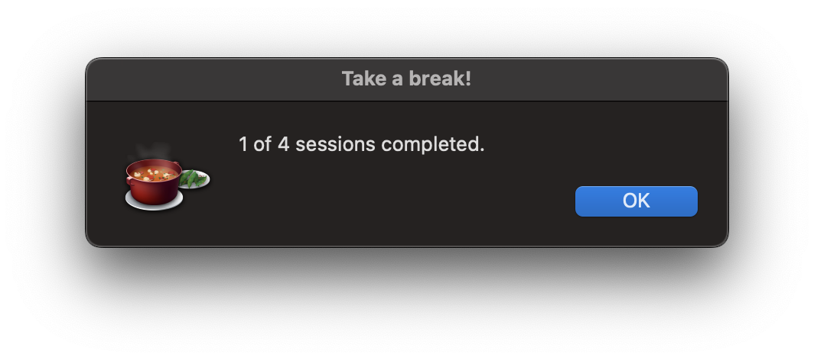
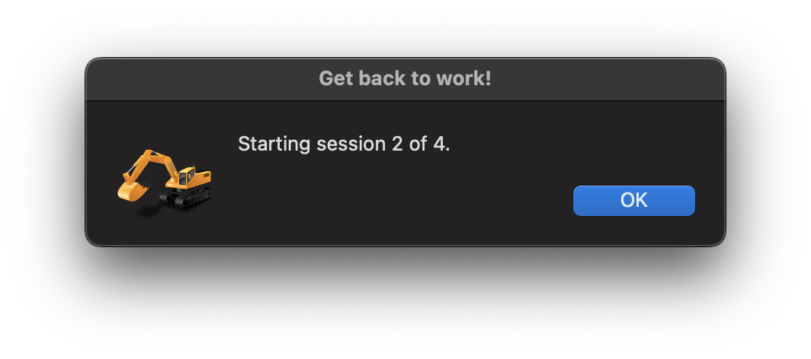
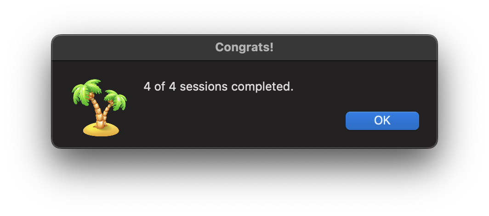

# pom
Simple pomodoro timer for macOS using shell commands and Mac automation alerts. By default, the timer runs four 25 minute work sessions interspersed with 5 minute breaks.

## Instructions:
The easiest way to install and run this pomodoro timer is:
1. Open terminal and run:
```
$ git clone https://github.com/thomasjankovic/pom.git
$ cd pom
$ python pom.py
```
2. To customize the number of working sessions, add `-s` followed by the desired number of sessions. For example, the following runs three sessions: 
```
$ python pom.py -s 3
```
3. To customize the work session duration, add `-w` followed by the desired number of minutes. To customize the break duration, add `-b` followed by the desired number of minutes. For example, the following runs three 50 minute work sessions interspersed with 10 minute breaks:
```
$ python pom.py -s 3 -w 50 -b 10
```
4. To cancel the entire session at any point, press control+c.

## Screenshots:
### End of session

### End of break

### End of timer


## Laterbase:
- [x] Receive command line input for number of sessions.
- [X] Look into difference between time and datetime libraries. Should probably stick to just one. They seem suited to these particular use cases.
- [X] Recieve command line input for work session length and break length.
- [X] Custom alert icons.
- [ ] Specify reqs and use virtual environment.
- [ ] Child process that runs timer so terminal is freed up. 
- [ ] 5 more minutes button.
- [ ] Pause button?